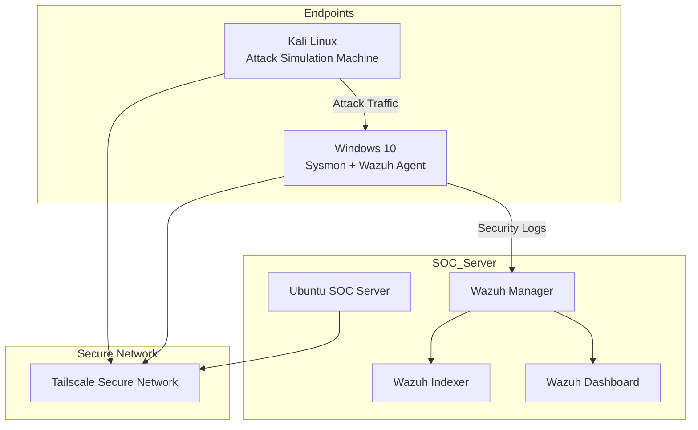

# Week 1 – SOC Infrastructure Architecture

## Overview

Week 1 focuses on deploying the foundational infrastructure required for the SOC monitoring environment.

The architecture consists of multiple virtual machines connected through a **secure Tailscale VPN network**, allowing encrypted communication between the SOC server, monitored endpoints, and attacker machine.

The SOC server hosts the **Wazuh SIEM platform**, which collects, analyzes, and visualizes security events from connected agents.

---

# SOC Infrastructure Architecture

---

# Architecture Components

## SOC Server (Ubuntu)

The SOC server hosts the core SIEM infrastructure including:

- Wazuh Manager
- Wazuh Indexer
- Wazuh Dashboard

The server is responsible for collecting logs from endpoints, analyzing security events, and generating alerts.

---

## Windows Endpoint

The Windows machine acts as the monitored endpoint.

Installed components include:

- Wazuh Agent
- Sysmon for detailed system activity logging

This system generates logs related to authentication events, file changes, and system processes.

---

## Kali Linux Attacker Machine

Kali Linux is used to simulate adversary behavior including:

- Brute-force login attempts
- Attack simulations
- MITRE ATT&CK technique execution

These attacks help test the detection capabilities of the SOC environment.

---

## Tailscale Secure Network

All machines communicate through a **Tailscale mesh VPN network**, which provides:

- Encrypted peer-to-peer communication
- Secure connectivity between virtual machines
- Simplified networking configuration
- Private internal IP addressing

This ensures secure log transmission and safe attack simulation within the lab environment.

---

# Data Flow

1. The attacker machine (Kali Linux) performs simulated attacks.
2. The Windows endpoint generates security logs.
3. The Wazuh Agent forwards logs to the Wazuh Manager.
4. The Wazuh Manager analyzes events and generates alerts.
5. Alerts are indexed and visualized in the Wazuh Dashboard.

---

# Security Benefit

This architecture enables the SOC lab to simulate enterprise-level monitoring while maintaining secure communication between all systems using Tailscale VPN.