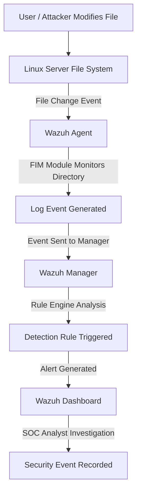

# Week 2 – Detection Rules Architecture

## Overview

Week 2 focuses on implementing **detection logic** inside the Wazuh Security Monitoring System.  
The objective is to detect unauthorized file changes using **File Integrity Monitoring (FIM)** and generate security alerts in real time.

This stage builds the **core detection capability** of the SOC-EDR Grid.

---

# Detection Pipeline Architecture

---

# Flow Explanation

### 1. File Modification
A file located in a monitored directory is modified manually or by an attacker.

### 2. FIM Monitoring
The **File Integrity Monitoring (FIM)** module inside the Wazuh Agent detects the change.

### 3. Event Generation
The agent generates a log event containing:

- File path
- Modification time
- File checksum changes

### 4. Event Transmission
The event is forwarded to the **Wazuh Manager**.

### 5. Rule Analysis
The Wazuh rule engine analyzes the event using predefined rules.

### 6. Alert Generation
If a rule matches, an alert is generated and displayed in the **Wazuh Dashboard**.

---

# Security Impact

This architecture enables the SOC to:

- Detect unauthorized file changes
- Monitor critical system directories
- Identify potential system tampering
- Alert security analysts immediately

