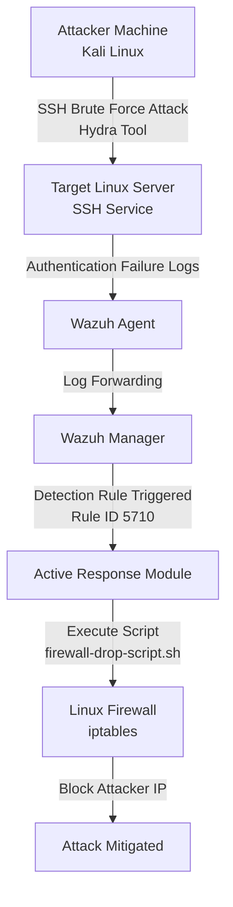

# Week 3 – Active Response Architecture

## Overview

This diagram represents the **Active Response workflow** implemented in the SOC-EDR Grid environment using **Wazuh**.  
It shows how a brute-force SSH attack is detected and automatically mitigated by blocking the attacker's IP address using firewall rules.

---

## Active Response Architecture Diagram



---

# Flow Explanation

### 1. Attack Initiation
An attacker from a **Kali Linux machine** launches a brute-force attack against the SSH service using the Hydra password-cracking tool.

### 2. Log Generation
The target Linux server generates multiple **authentication failure logs** due to repeated login attempts.

### 3. Log Collection
The **Wazuh Agent** installed on the target system collects these authentication logs.

### 4. Log Analysis
The logs are sent to the **Wazuh Manager**, where security rules analyze the events.

### 5. Threat Detection
When multiple failed login attempts occur, **Wazuh Rule ID 5710** detects the brute-force attack pattern.

### 6. Active Response Execution
Once the rule is triggered, the **Active Response module** executes the script:

```
configs/firewall-drop-script.sh
```

### 7. Firewall Enforcement
The script inserts a firewall rule using:

```
iptables -I INPUT -s <attacker-ip> -j DROP
```

This rule blocks the attacker’s IP address and stops further attack attempts.

---

# Security Impact

The Active Response implementation provides:

- Automated attack mitigation
- Faster SOC incident response
- Reduced manual intervention
- Real-time blocking of malicious sources

This effectively upgrades the monitoring system into an **Intrusion Prevention System (IPS)**.