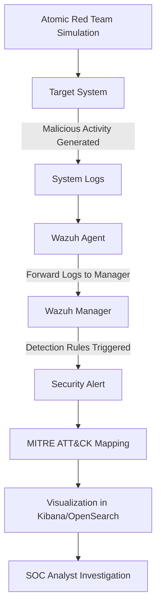

# Week 4 – Threat Simulation using Atomic Red Team

## Overview

Week 4 focuses on simulating real-world adversary techniques to evaluate the detection capabilities of the SOC monitoring infrastructure.  
The simulation is performed using the **Atomic Red Team framework**, which allows controlled execution of adversary techniques mapped to the **MITRE ATT&CK framework**.

This phase validates whether the deployed **Wazuh-based EDR Grid** can detect advanced attack behaviors and provide visibility into the attack lifecycle.

---

# Objective

The objective of this phase is to simulate ransomware-related attack techniques and verify that the SOC environment detects the activity and generates alerts mapped to the MITRE ATT&CK framework.

---

# Threat Simulation Architecture



---

# Technologies Used

- Wazuh Manager  
- Wazuh Agent  
- Atomic Red Team  
- MITRE ATT&CK Framework  
- Kibana / OpenSearch Dashboard  
- PowerShell  

---

# Attack Technique Simulated

MITRE ATT&CK Technique:

```
T1490 – Inhibit System Recovery
```

This technique is commonly used by ransomware to delete **Volume Shadow Copies**, preventing system recovery after file encryption.

---

# Attack Execution

The simulation was executed using the Atomic Red Team framework.

Example command:

```
Invoke-AtomicTest T1490
```

This command simulates ransomware behavior by deleting shadow copies on the target system.

---

# Detection Process

1. Atomic Red Team executes the attack simulation.
2. The system generates suspicious activity logs.
3. The **Wazuh Agent** collects the logs from the host.
4. Logs are forwarded to the **Wazuh Manager**.
5. Detection rules analyze the activity.
6. A security alert is generated and mapped to the **MITRE ATT&CK technique**.

---

# Repository Structure

```
Week-4-Threat-Simulation
│
├── architecture
│   └── threat-simulation-flow.md
│
├── commands
│   └── atomic-red-team-commands.md
│
├── attack-simulation
│   └── ransomware-simulation.md
│
├── screenshots
│
├── verification
│   └── week4-verification.md
│
└── README.md
```

---

# Verification

The system behavior was verified by observing:

- Alerts generated in the Wazuh dashboard
- MITRE ATT&CK technique mapping
- Event logs generated during simulation
- Visualization of attack activity in Kibana/OpenSearch

Screenshots and evidence are stored inside the **screenshots** directory.

---

# Result

The SOC monitoring infrastructure successfully detected the simulated attack technique and mapped the activity to the MITRE ATT&CK framework.

This confirms that the deployed system can detect advanced adversary behaviors and provide visibility into the attack lifecycle.

---

# Conclusion

Week 4 completes the SOC-EDR Grid implementation by validating detection capabilities through real-world threat simulation.

The environment is now capable of:

- Detecting adversary techniques
- Mapping alerts to MITRE ATT&CK
- Visualizing attack activity
- Supporting SOC analyst investigation

This final phase demonstrates the effectiveness of the implemented **Enterprise EDR and Threat Hunting Grid**.