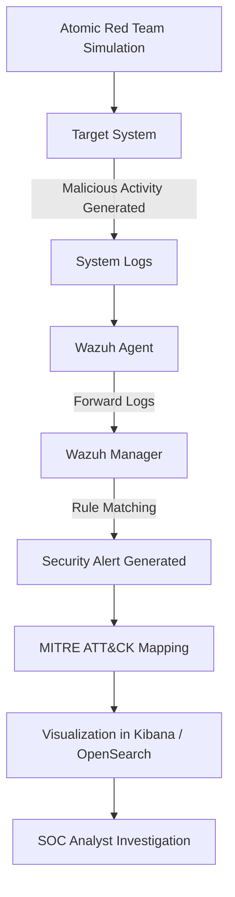

# Week 4 – Threat Simulation Architecture

## Overview

Week 4 focuses on simulating real-world attack techniques using the **Atomic Red Team framework**.  
The goal is to test whether the SOC monitoring environment can detect malicious behavior and map it to the **MITRE ATT&CK framework**.

---

# Threat Simulation Flow

---

# Flow Explanation

1. **Atomic Red Team** simulates a real attack technique.
2. The attack generates suspicious system activity.
3. The **Wazuh Agent** collects system logs.
4. Logs are sent to the **Wazuh Manager**.
5. Detection rules identify malicious patterns.
6. Alerts are mapped to **MITRE ATT&CK techniques**.
7. The attack chain is visualized in the dashboard.

---

# Security Impact

Threat simulation allows SOC teams to:

- Test detection capabilities
- Validate monitoring infrastructure
- Identify detection gaps
- Improve defensive strategies