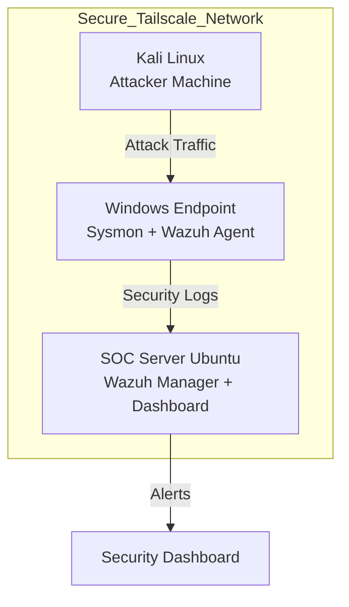
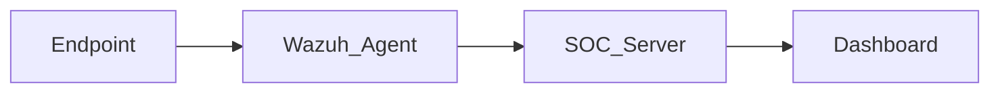
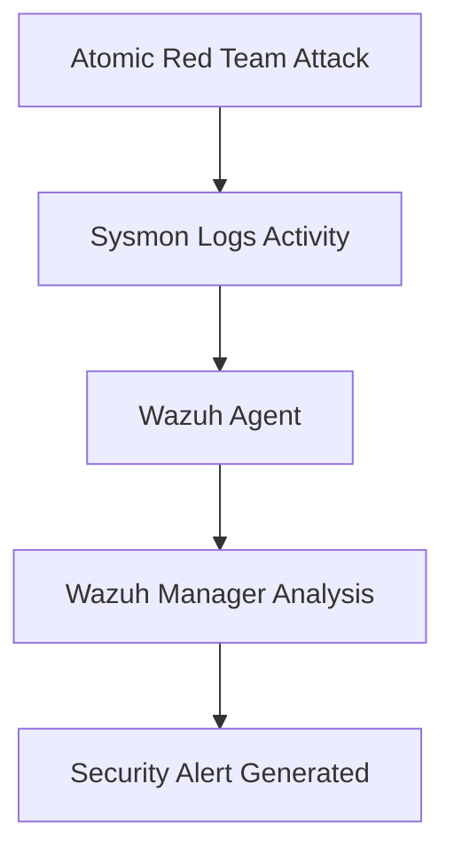

# 🛡️ Sentient Shield SOC-EDR Grid
### Enterprise EDR & Threat Hunting Grid

🚀 **Security Operations Center Monitoring Lab**

---

       


## 📌 Project Overview

The **Sentient Shield SOC-EDR Grid** is a simulated **Security Operations Center (SOC)** environment designed to demonstrate **enterprise-level security monitoring and threat detection**.

This project uses modern cybersecurity tools such as:

⚙️ **Wazuh SIEM**  
🖥️ **Sysmon Logging**  
🧪 **Atomic Red Team**  
🔐 **Tailscale Secure Network**

to monitor system activity, detect malicious behavior, and visualize cyber attacks using the **MITRE ATT&CK Framework**.

---

## 🎯 Project Objectives

The main objectives of this project include:

✔ Deploy a **SOC monitoring infrastructure**  
✔ Collect and analyze logs from multiple endpoints  
✔ Implement **File Integrity Monitoring (FIM)**  
✔ Configure **Active Response automation**  
✔ Simulate **real-world cyber attacks**  
✔ Map alerts to **MITRE ATT&CK techniques**

---

## ⚠️ Problem Statement

Modern organizations face **continuous cyber threats** such as:

🔴 Brute-force login attacks  
🔴 Ransomware activity  
🔴 Unauthorized file modification  
🔴 Credential theft  

Without a centralized monitoring system, it becomes difficult to detect these threats in real time.

The **SOC-EDR Grid** solves this by implementing a **centralized security monitoring architecture** capable of detecting suspicious behavior and responding automatically.

---

# 🏗️ SOC Architecture

All machines are connected through a **secure Tailscale VPN network**.



---

# 🧰 Tools and Technologies

| Tool | Purpose |
|-----|------|
| 🛡️ Wazuh | SIEM & Endpoint Detection |
| 🐧 Ubuntu Server | SOC Monitoring Server |
| 🪟 Windows 10 | Monitored Endpoint |
| 🐉 Kali Linux | Attack Simulation |
| 🔍 Sysmon | Windows System Activity Logging |
| ⚔️ Atomic Red Team | Threat Simulation |
| 🔐 Tailscale | Secure VPN Connectivity |
| 💻 VirtualBox | Virtual Lab Environment |
| 📂 GitHub | Version Control |

---

# 💻 System Requirements

## Hardware Requirements

| Component | Requirement |
|----------|-------------|
| CPU | Dual Core or Higher |
| RAM | Minimum 4GB |
| Storage | Minimum 40GB |
| Network | Stable LAN / Virtual Network |

---

## Software Requirements

Operating Systems:

• Ubuntu Server 22.04  
• Windows 10  
• Kali Linux  

Security Tools:

• Wazuh SIEM  
• Sysmon  
• Atomic Red Team  

Development Tools:

• Git  
• GitHub  

---

# ⚙️ Project Implementation

The project was implemented in **4 phases**.

---

## 📅 Week 1 – Infrastructure Setup

In this phase, the SOC monitoring infrastructure was deployed.

Tasks performed:

✔ Installed **Wazuh Manager**  
✔ Installed **Wazuh Indexer**  
✔ Installed **Wazuh Dashboard**  
✔ Configured **SOC server**  
✔ Installed **Wazuh agents**

### System Deployment Flow



---

## 📅 Week 2 – Detection Rules

Detection mechanisms were configured to monitor sensitive system activity.

Key implementations:

✔ File Integrity Monitoring  
✔ Custom detection rules  
✔ Vulnerability detection module  

Example alert generated:

```
Rule ID: 550
Description: Integrity checksum changed
MITRE Technique: T1565
```

---

## 📅 Week 3 – Active Response

Active response mechanisms were configured to automatically block malicious attackers.

Example configuration:

```
<active-response>
<command>firewall-drop</command>
<location>local</location>
<rules_id>5710</rules_id>
</active-response>
```

Attack Simulation:

```
ssh wronguser@SOC-IP
```

Result:

🚨 Multiple authentication failures detected

---

## 📅 Week 4 – Threat Simulation

Real attack techniques were simulated using **Atomic Red Team**.

MITRE ATT&CK Technique:

```
T1490 — Inhibit System Recovery
```

Example attack command:

```
vssadmin delete shadows /all /quiet
```

This command is commonly used by **ransomware** to prevent system recovery.

---

# 🔍 Detection Workflow



---

# 📊 Results

The SOC-EDR Grid project successfully demonstrated:

✅ Centralized security monitoring  
✅ Real-time attack detection  
✅ Endpoint monitoring  
✅ File integrity monitoring  
✅ Threat simulation using Atomic Red Team  
✅ MITRE ATT&CK mapping

---

# 🎓 Conclusion

The **Sentient Shield SOC-EDR Grid** successfully implemented a functional **Security Operations Center monitoring environment** capable of detecting and responding to simulated cyber attacks.

This project provided hands-on experience with:

🔹 SIEM deployment  
🔹 Endpoint monitoring  
🔹 Threat detection  
🔹 Attack simulation  
🔹 SOC operational workflows  

---

# 🚀 Future Improvements

Future enhancements may include:

• Threat intelligence integration  
• Network traffic monitoring  
• Malware analysis capabilities  
• Automated incident response workflows  
• Integration with additional cybersecurity tools

---

# 📚 References

1. Wazuh Documentation – https://documentation.wazuh.com  
2. MITRE ATT&CK Framework – https://attack.mitre.org  
3. Atomic Red Team – https://github.com/redcanaryco/atomic-red-team  
4. Sysmon Documentation – https://learn.microsoft.com/en-us/sysinternals/downloads/sysmon  
5. Tailscale Documentation – https://tailscale.com/docs  
6. OpenAI ChatGPT – https://chat.openai.com  
7. GitHub Documentation – https://docs.github.com

---

# 👨‍💻 Developed By

## 🚀 Project Team

| Team Member | 
|-------------|
| **C Haritha** | Team Lead |
| **Sanjana Yoga** |
| **Monisha A M** |
| **Vishal Mane** |

---

📌 **Project Context**

This project was developed as part of the **Security Operations Center (SOC) Internship Program** at:

**Infotact Solutions**  
Cyber Defense Operations Center (**CDOC**)

---